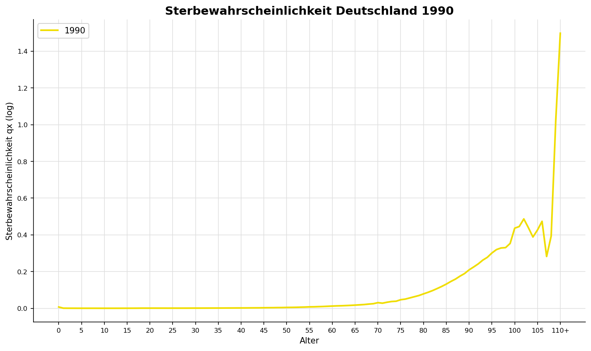
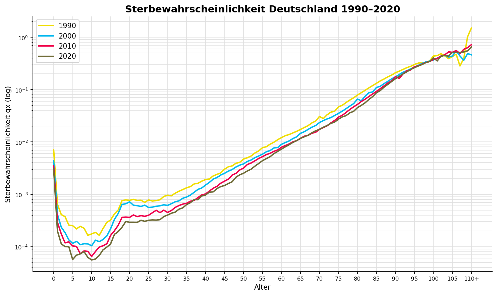
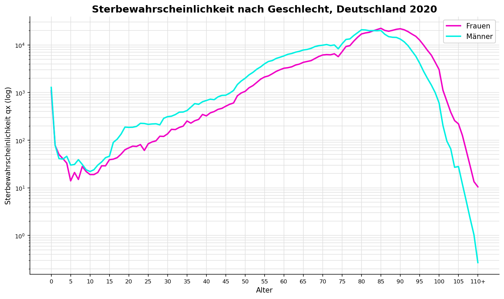
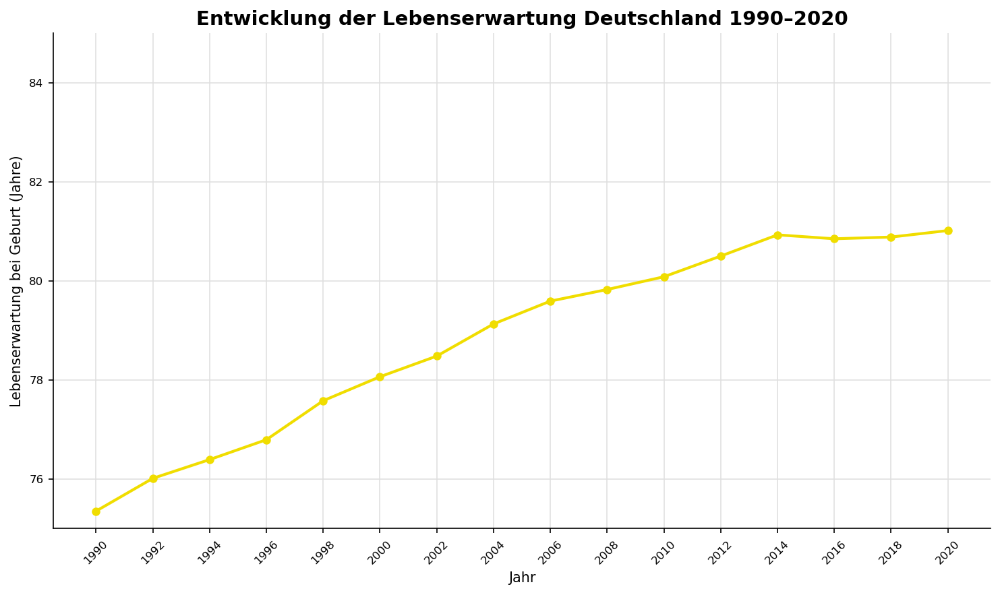
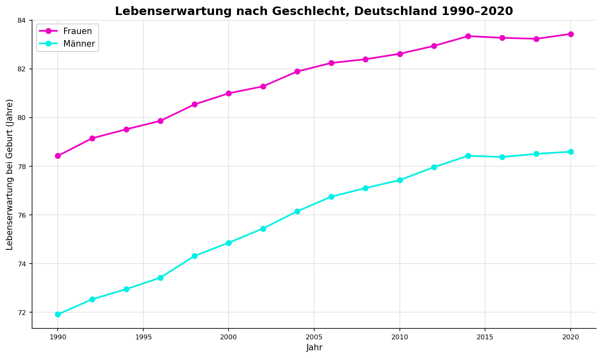

# Sterbetafelanalyse Deutschland 1990–2020

## Überblick
Analyse der Mortalitätsentwicklung in Deutschland auf Basis amtlicher 
Sterbetafeldaten. Das Projekt berechnet Sterbewahrscheinlichkeiten, 
konstruiert vollständige Sterbetafeln und untersucht die Entwicklung 
der Lebenserwartung über drei Jahrzehnte.

## Datenquelle
Human Mortality Database (mortality.org)  
Zeitraum: 1990–2020 | Granularität: Einzeljahre nach Alter und Geschlecht

## Methodik
- Berechnung der zentralen Sterberate mx aus Todesfällen und Exposition
- Umrechnung in Sterbewahrscheinlichkeit qx via UDD-Näherung
- Konstruktion vollständiger Sterbetafeln (lx, dx, Lx, Tx, ex)
- Lebenserwartung bei Geburt e₀ für alle verfügbaren Jahre

## Ergebnisse
- Lebenserwartung stieg von 75.4 Jahren (1990) auf 81.0 Jahre (2020)
- Stagnation ab ca. 2014 – konsistent mit internationalen Befunden
- Gender Gap verringerte sich von ~6 auf ~4 Jahre
- Klassische Gompertz-Struktur der Alterssterblichkeit bestätigt
- Wiedervereinigungseffekt in frühen Jahrgängen sichtbar

## Tools
Python | pandas | numpy | matplotlib | Jupyter Notebook

## Ausblick
Mögliche Erweiterungen: Kohortensterbetafeln, Projektion zukünftiger 
Lebenserwartung (Lee-Carter-Modell), Vergleich mit anderen Ländern

## Visualisierungen

## Datenquelle
Human Mortality Database (mortality.org) – kostenloser Account erforderlich.  
Benötigte Dateien: Deaths_1x1 und Exposures_1x1 für Deutschland (DEUTNP).